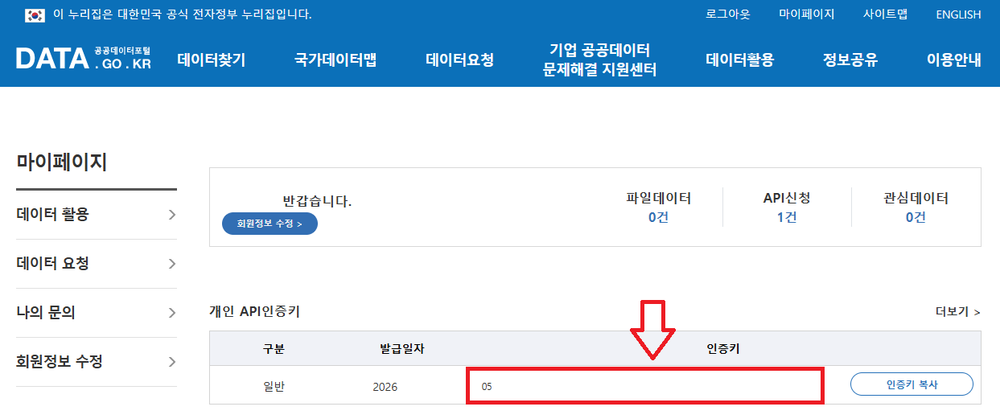

# 나라장터 입찰공고 자동 알리미

나라장터 용역 공고를 자동 수집하고, 실무에 필요한 조건으로 필터링한 뒤 Slack으로 알려주는 경량 자동화 프로젝트입니다.

Windows 작업 스케줄러에 등록해 두면 월-금 매일 자동으로 실행됩니다.

## 한눈에 보기

- 매일 나라장터 용역 공고를 자동 수집해 1차 검색 키워드 + 2차 키워드 + 제외/예산 조건으로 필터링하고 Slack으로 알립니다.
- 월-금 스케줄 실행을 지원하며, 월요일에는 금-일 3일치 공고를 한 번에 조회합니다.
- API 재시도, 결과 없음 알림, 오류 알림, 로그 기록까지 기본 운영 기능을 포함합니다.

## 아키텍처

```text
main.py
    -> api_client.py       (나라장터 API 호출)
    -> bid_filter.py       (1차/2차/제외/예산 필터)
    -> slack_notifier.py   (Slack 메시지 전송)
    -> config.py           (환경변수/비즈니스 규칙/로그 설정)
```

## 프로젝트 구조

```text
koneps-noti/
├─ api_client.py
├─ bid_filter.py
├─ config.py
├─ main.py
├─ slack_notifier.py
├─ test_runner.py
├─ run_manual.bat
├─ register_scheduler.bat
├─ requirements.txt
├─ log/
└─ README.md
```

## 빠른 시작

요구사항: Python 3.8+

1. 의존성 설치: `pip install -r requirements.txt`
2. 프로젝트 루트에 `.env` 파일 생성 후 아래 값 입력

    API_SERVICE_KEY=여기에_나라장터_API_인증키

    SLACK_WEBHOOK_URL=https://hooks.slack.com/services/여기에_웹훅_URL

    나라장터 API 인증키는 아래 페이지에서 활용신청 후 마이페이지에서 인증키를 입력합니다.

    https://www.data.go.kr/data/15058815/openapi.do
    

3. 실행: `register_scheduler.bat` 더블클릭하여 원하는 배치 시간을 입력하면 끝

(등록 확인: `Win + R` -> `taskschd.msc`)

## 수동 실행 방법

`run_manual.bat` 실행 시 수동으로 나라장터 알림을 보냅니다.

## 테스트/점검 명령

```powershell
python test_runner.py api      # 나라장터 API 연결 및 응답 구조 점검
python test_runner.py filter   # 필터 로직(1차/2차/제외/예산) 단위 테스트
python test_runner.py slack    # Slack 웹훅 전송 테스트
python test_runner.py preview  # Slack 전송 없이 필터 통과 결과 미리보기
python test_runner.py full     # 전체 파이프라인(fetch -> filter -> notify) 실행 테스트
```

## 주요 설정값

`config.py`에서 아래를 조정할 수 있습니다.

- `SEARCH_KEYWORDS`: 검색 키워드
- `SECONDARY_KEYWORDS`: 2차 필터 키워드
- `EXCLUDE_KEYWORDS`: 제외 키워드
- `MAX_BUDGET_WON`: 예산 상한
- `TOP_N_RESULTS`: Slack 전송 개수

## 장애 대응 가이드

### 스케줄러 등록 실패

- 시간 형식을 확인하세요 (`HH:MM`).
- 관리자 권한으로 다시 실행해 보세요.
- 콘솔의 `schtasks 종료 코드`와 `최종 결과`를 확인하세요.

### 실행은 되는데 알림이 안 오는 경우

- `.env`의 `SLACK_WEBHOOK_URL` 확인
- `.env`의 `API_SERVICE_KEY` 확인 (401 Unauthorized 발생 시 인증키 오입력/만료 여부 점검)
- 네트워크/보안 정책 확인
- `log/bid_monitor.log` 에러 로그 확인

### 공고가 너무 적거나 많은 경우

- `SEARCH_KEYWORDS`, `SECONDARY_KEYWORDS`, `EXCLUDE_KEYWORDS` 조정
- `MAX_BUDGET_WON` 조정
- `python test_runner.py preview`로 전송 전 결과 확인
